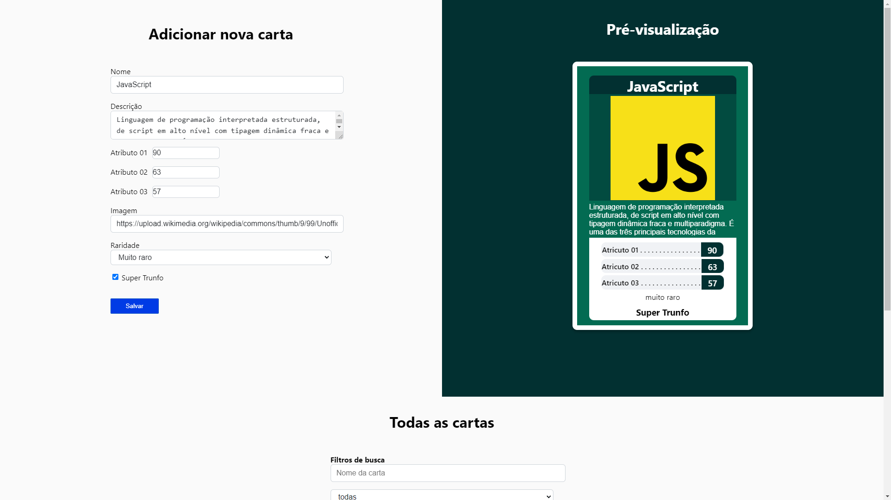

<h1 align="center">Projeto - Tryunfo</h1>

<strong>👨‍💻 O que foi desenvolvido</strong>
 

Neste projeto eu desenvolvi um jogo no estilo Super Trunfo! Ao utilizar essa aplicação uma pessoa usuária deverá ser capaz de:

- Criar um baralho com o tema livre;

- Adicionar e remover uma carta do baralho;

- Visualizar todas as cartas que foram adicionadas ao baralho;

- Jogar com o baralho criado.

